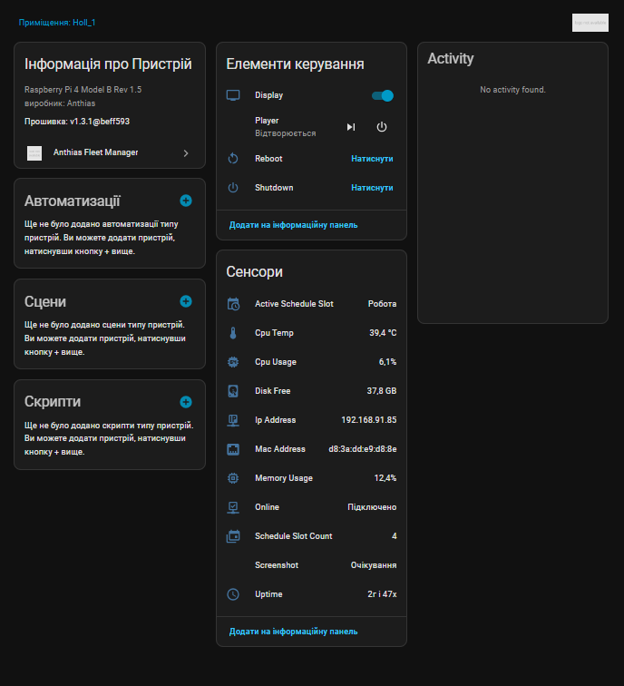
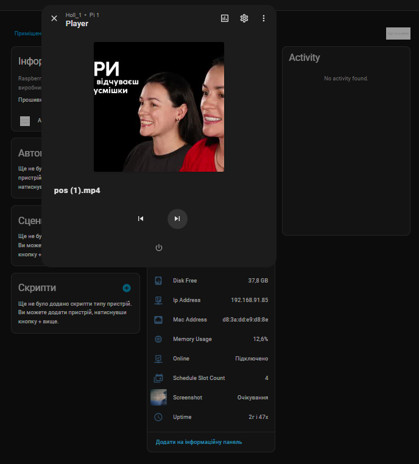
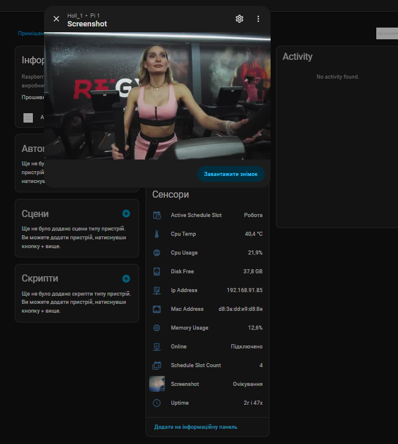
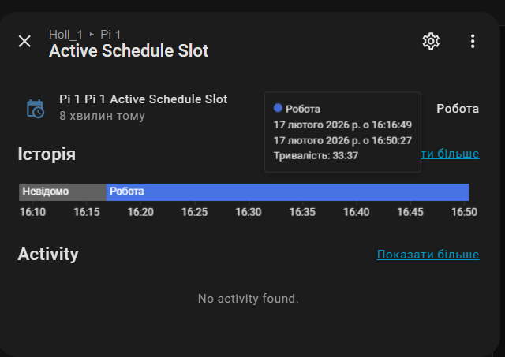
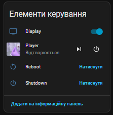
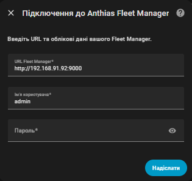
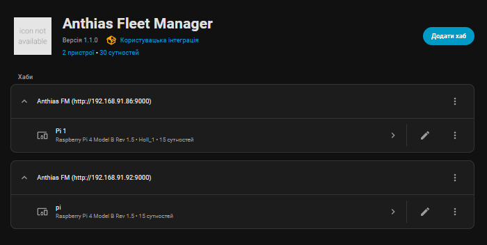

# Anthias Fleet Manager for Home Assistant

[](https://github.com/hacs/integration)
[](https://github.com/Alex1981-tech/anthias-fleet-manager-ha/releases)
[](https://www.home-assistant.io/)

Home Assistant integration for [Anthias Fleet Manager](https://github.com/Alex1981-tech/Anthias-fleet-manager) — monitor and control your Anthias digital signage players directly from Home Assistant.

## Screenshots

<table>
  <tr>
    <td align="center"><b>Device Page</b><br><sub>All entities at a glance</sub></td>
    <td align="center"><b>Media Player</b><br><sub>Live playback with screenshot</sub></td>
  </tr>
  <tr>
    <td></td>
    <td></td>
  </tr>
  <tr>
    <td align="center"><b>Camera — Live Screenshot</b><br><sub>Real-time display capture</sub></td>
    <td align="center"><b>Schedule Slot Sensor</b><br><sub>Active slot with history</sub></td>
  </tr>
  <tr>
    <td></td>
    <td></td>
  </tr>
  <tr>
    <td align="center"><b>Controls</b><br><sub>CEC display, reboot, shutdown</sub></td>
    <td align="center"><b>Config Flow</b><br><sub>Easy setup via UI</sub></td>
  </tr>
  <tr>
    <td></td>
    <td></td>
  </tr>
</table>

<details>
<summary>Integration overview — hubs & players</summary>

</details>

## Features

### Entities (per player)

| Platform | Entity | Description |
|----------|--------|-------------|
| Binary Sensor | **Online Status** | Player connectivity (online/offline) |
| Sensor | **CPU Temperature** | CPU temperature in Celsius |
| Sensor | **CPU Usage** | CPU usage percentage |
| Sensor | **Memory Usage** | RAM usage percentage |
| Sensor | **Disk Free** | Free disk space in GB |
| Sensor | **Uptime** | Uptime in hours |
| Sensor | **IP Address** | Player IP address |
| Sensor | **MAC Address** | Player MAC address |
| Sensor | **Active Schedule Slot** | Currently active schedule slot name (with slot list in attributes) |
| Sensor | **Schedule Slot Count** | Number of configured schedule slots |
| Switch | **Display (CEC)** | TV power on/off via HDMI-CEC |
| Media Player | **Player** | Current content with screenshot, next/prev track, CEC on/off |
| Camera | **Screenshot** | Live screenshot from player display (10s refresh) |
| Button | **Reboot** | Reboot the player |
| Button | **Shutdown** | Shutdown the player |

### Services (for automations)

| Service | Description |
|---------|-------------|
| `deploy_content` | Deploy media from FM content library to player |
| `create_asset` | Create a URL/webpage asset on player |
| `delete_asset` | Delete an asset from player |
| `toggle_asset` | Enable or disable an asset |
| `create_schedule_slot` | Create a schedule slot (default / time / event) |
| `delete_schedule_slot` | Delete a schedule slot |
| `add_slot_item` | Add an asset to a schedule slot |
| `remove_slot_item` | Remove an item from a schedule slot |
| `trigger_update` | Trigger player software update (via Watchtower) |

## Installation

### HACS (Recommended)

1. Open **HACS** in Home Assistant
2. Click the three-dot menu → **Custom repositories**
3. Add `https://github.com/Alex1981-tech/anthias-fleet-manager-ha` as **Integration**
4. Search for **"Anthias Fleet Manager"** and install
5. Restart Home Assistant

### Manual

1. Download the [latest release](https://github.com/Alex1981-tech/anthias-fleet-manager-ha/releases)
2. Copy `custom_components/anthias_fleet_manager` to your HA `config/custom_components/` directory
3. Restart Home Assistant

## Configuration

1. Go to **Settings** → **Devices & Services** → **Add Integration**
2. Search for **"Anthias Fleet Manager"**
3. Enter your Fleet Manager URL (e.g. `http://192.168.1.100:9000`)
4. Enter username and password
5. Click **Submit**

The integration auto-discovers all players registered with your Fleet Manager and creates a device with entities for each one.

## Automation Examples

### Turn Off Displays After Hours

```yaml
automation:
  - alias: "Turn off displays at closing time"
    trigger:
      - platform: time
        at: "22:00:00"
    action:
      - service: switch.turn_off
        target:
          entity_id: switch.lobby_display_display

  - alias: "Turn on displays in the morning"
    trigger:
      - platform: time
        at: "08:00:00"
    action:
      - service: switch.turn_on
        target:
          entity_id: switch.lobby_display_display
```

### Nightly Reboot

```yaml
automation:
  - alias: "Nightly player reboot"
    trigger:
      - platform: time
        at: "03:00:00"
    action:
      - service: button.press
        target:
          entity_id: button.lobby_display_reboot
```

### Emergency Message on All Players

```yaml
automation:
  - alias: "Emergency message on all players"
    trigger:
      - platform: state
        entity_id: binary_sensor.fire_alarm
        to: "on"
    action:
      - service: anthias_fleet_manager.create_asset
        data:
          player_id: "your-player-uuid"
          name: "Emergency Alert"
          uri: "https://your-server.com/emergency.html"
          duration: 30
          mimetype: "webpage"
```

### Alert When Player Goes Offline

```yaml
automation:
  - alias: "Alert when player goes offline"
    trigger:
      - platform: state
        entity_id: binary_sensor.lobby_display_online
        to: "off"
        for: "00:05:00"
    action:
      - service: notify.mobile_app
        data:
          title: "Player Offline"
          message: "Lobby display has been offline for 5 minutes"
```

## Requirements

- **Anthias Fleet Manager** v1.4.0+
- **Home Assistant** 2024.1+
- Network access from Home Assistant to Fleet Manager

## Links

- [Anthias Fleet Manager](https://github.com/Alex1981-tech/Anthias-fleet-manager) — the fleet management server
- [Anthias](https://github.com/Screenly/Anthias) — open-source digital signage for Raspberry Pi

## License

MIT
